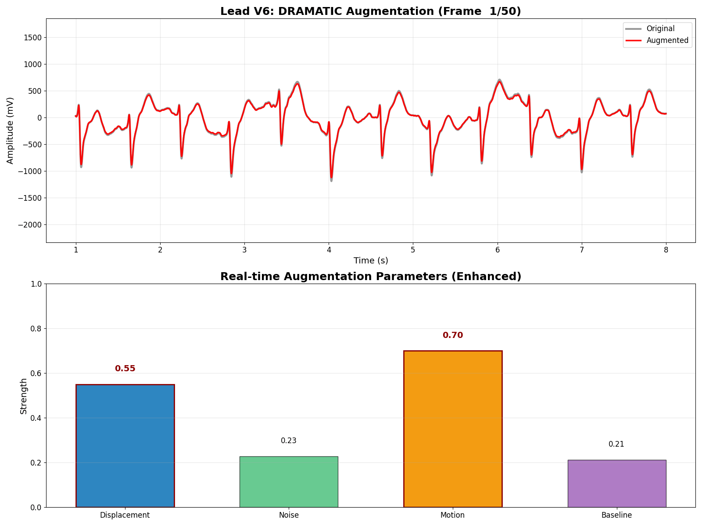

# AI for Wearable ECG Prototype  

Author: Jennifer E. Yoon   
Timeline: <a href="_timeline.md" > _timeline.md </a>   
Company: Areteus (https://areteus.us/)   

### SciPy 2025: virtual poster presentation, July 9, 2025    
 * See Final Poster: <a href="SciPy2025-poster/scipy2025_poster_JYoon_AI_for_Wearable.jpg">SciPy Poster</a>
 * See <a href="https://github.com/JennEYoon/ECG-transform/blob/main/SciPy2025-poster/results/tables_1dcnn.md" >Early Findings</a>
 
 * Title: AI for wearable ECG prototype - quantified health  
 * Proposed Abstract: I will share my experience customizing AI models for a wearable ECG (electrocardiogram) prototype, including Transformers, ResNets, and Random Forests. While intended for data science students and practitioners, anyone interested in wearable devices or quantified health is welcome. Listeners will gain practical insights to apply in their own AI projects.  
Hospital-grade 12-signal ECG machines are bulky and expensive, while at-home devices capture only 1–6 asynchronous signals. The Areteus wearable ECG is designed for continuous home use, recording 12–19 synchronous signals. It is especially useful for detecting abnormal heartbeats during sleep and strenuous exercise.

 * conference: https://www.scipy2025.scipy.org/  
 * tags: #SciPy2025  #ECG-prototype  #AI  #quantified-health  
 * Image: Areteus ECG, close-up of processing chip, V1, and V2 contacts.
      
     
  * GIF, Data Augmentation:   
    

=========================================================================  

# The rest of repo  
### 1. Quick Project Description:   

This repo contains a deep learning project for a wearable, ECG prototype.   
Areteus (https://www.areteus.us/) is developing a novel wearable ECG (heart rate monitoring) device. It's novel factors are: (1) continuously wearable at home and (2) comparable quality to hospital machines (12 or more signals, low noise). This AI project will customize ECG classification model(s) for the Areteus device. A demo of final AI model will show streaming diagnostic classifications using hospital datasets. Later, will deploy an app showing live signals from Areteus device(s) and continuously updated diagnostic classifications.  

### 2. Device Information:  

2.A) Areteus ECG device: <a href="https://github.com/JennEYoon/ECG-transform/blob/main/_Areteus_ECG_Device.md" >Areteus ECG device </a>.

 * Device output data format: work in process.  
   - First file request, Alondra, single recording, 5 seconds long, hexadecimal format text file.
   - Second file request, Alondra, 30 recordings, 10 seconds long, hexadecimal and raw binary format text files.
   - To convert to compatible machine learning input format.
   - Third data request, Jason, from current device output - WIP  
   
2.B) Hospital ECG devices  

2.C) Home-use ECG devices    

### 3. Stage 1: Literature and Public Datasets Research:  

3.A) Review original paper provided by Areteus.    
 * ECGTransForm paper: (https://www.sciencedirect.com/science/article/abs/pii/S1746809423011473)  
 * Repo: (https://github.com/emadeldeen24/ECGTransForm)
 * Datasets:
    - MIT-BIH (https://www.physionet.org/content/mitdb/1.0.0/)  
    - PTB (https://physionet.org/content/ptbdb/1.0.0/)  

3.B) Related papers and Jupyter notebooks, using MIT-BIH and PTB datasets.  
 * ResNet Kim et. al.
 * Simple CNN
 * Random Forest 

### 4. Stage 2: Deeper Literature and Datasets Research, 12-signal models:  

4.A) Overview of new efforts to collect large 12-signal ECG datasets for use in AI models, from different hospitals in different countries. Attempts to unify ECG diagnostic classifications. Attempts to collect high quality signals from diverse populations.   

4.B) Description of ECG contact placements  
Image: ECG signal leads positioning (chest: V1 to V6, limbs: I, II, III, AVL, AVR, AVF)  
Source: ECGPedia.org, part of CardioNetworks.org  

Chest lead description: 
V1 = 4th intercostal space right (IC4R), 
V2 = IC4L, V3=between V2 and V4, 
V4 = IC5 in midclavicular line, 
V5 = between V4 and V6, 
V6 = same height as V4 in axillary line. 
To register V4R, use V3 in the right mid-clavicular line.

Limb lead description:  to write  
I:  , II   , III   , AVL   , AVR    AVF = to foot  
Note only limb leads I and II are measured. The others a derived from I and II.  

4.C) Selected large, 12-signal datasets:  
 * PTB-XL large dataset (Physikalisch-Technische Bundesanstalt)
 * SPH large dataset (Shandong Provincial Hospital)

4.D) Data Issues, 12-signal public datasets:  

How to make full use of 12-signals in PTB data? How to split raw data into samples? What filter or processing should be used? What Python libraries might be useful?:  

Data processing choices, after discussions with Areteus:  
   * Use only peak centering and baseline zero calibration for now.  
   * Ignore other filters at this time (e.g., squaring to remove negative numbers, standardizing peak to peak distance, standardizing peak amplitude across patients)   
   * library: wsfl - for ECG data processing, standarizing.   
   * library: scikit-learn - for testing my own data splitting and filtering methods.   

4.E) Data Issues, Areteus device:  
Machine level data definition  
Convert hex to numpy array  
Convert binary to numpy array  
Limb signals linear combinations from 8 leads, add definition & convert before running AI model.  
Test AI classification model - proof of concept, that it works with device output data.  

4.F) Data Issues, augmented datasets:  
Build augmented datasets from public datasets, to mimic user error and signal interference & dropout.  
Test for less than ideal data output.  
Test AI classification models with noisy augmented data 

### 5. Early Findings:   

 * Noisy augmented dataset works well for diagnostic class inference.  
 * Initial results are based on 1D-CNN model with PTBXL dataset with 6 diagnostic classes.   
 * Original (89.1%) vs Augmented (84.9%) model test accuracies were in similar range.  
 * Both datasets were unfiltered. Accuracy goes up about 5%-10% after applying noise filters.  
 * Model parameters change test accuracy somewhat. In particular increasing the class number to 20-24 decreases model test accuracy dramatically.  

### 6. Device Signals Testing and AI Model Refinement:  

 * Planned: Jason, Pt Reyes, California:
   Testing Areteus device on volunteers with normal and abnormal heart beats.  

### 7. Deploy App on Cloud and Report Writing:  

 * documentation - started
 * organization - started
 * Embedding visualization (notebooks, website, apps) - August - Oct, 2025     
 * Interactive python viz libraries (Plotly, Bokeh, Voila) - August - Oct, 2025   

