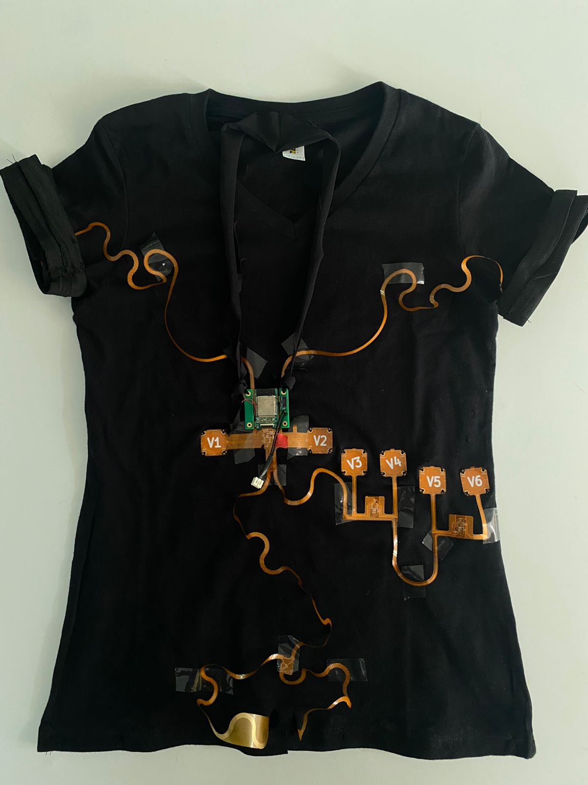
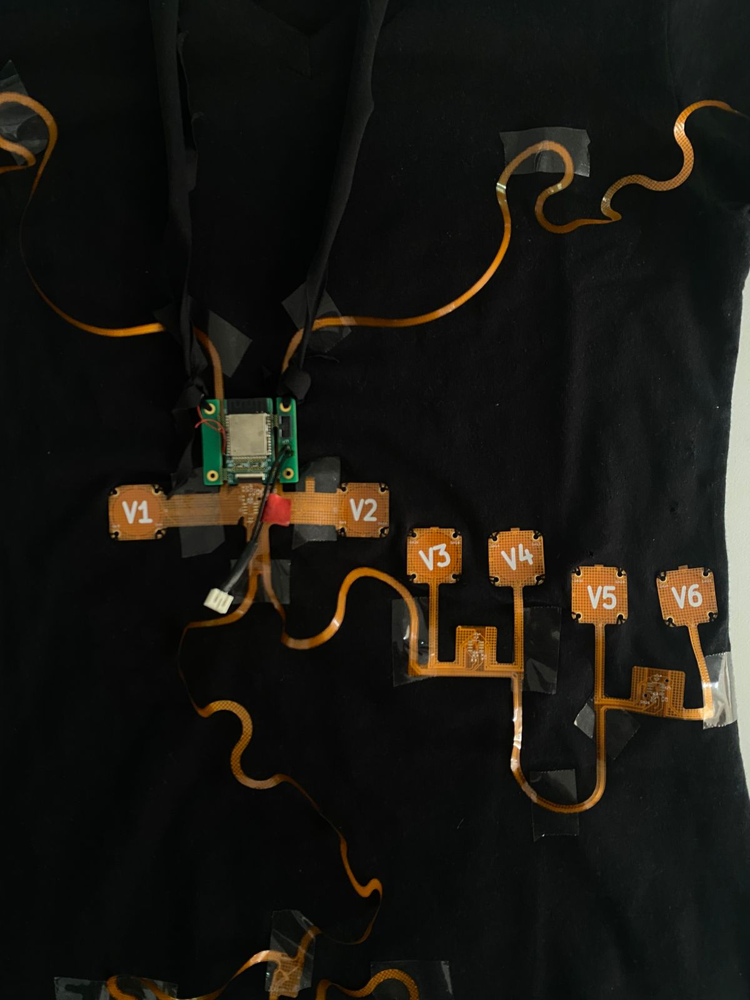
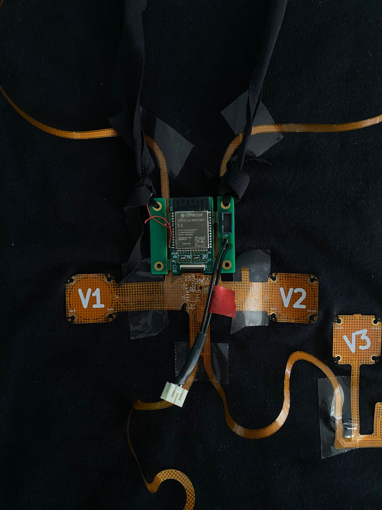

# Wearable ECG Device  
### a work in process, prototype ECG monitoring device 

This is a description of the in-development prototype device, with 12-19 electrical leads. Jason Yoon of Areteus.us is the primary hardware engineer. (See <a href="https://www.areteus.us/">Areteus.us</a>) The device will be attached to a stretchy shirt, and the whole shirt can be put on or taken off. Device reads electrical signals upto 2 inches away from skin. Current iteration is for 12-19 leads. Standard hospital ECG readers usually have 12 electrical leads.  Of course the hospital readers are much larger and is not wearable. This device is designed to allow continuous wear, except for when immersing in water, ex. showering, bathing or swimming. 

The upper 2 electrical wires attach to user's arms. Main chest area leads attach around the heart. V1 and V2 are closest to the heart. Bottom 2 leads attach to abdomin left and right sides on multiple points.  

Date:   As of January 23, 2025  
Author: Jennifer Yoon   

Photos of Device:  

  * ***Img1 - full t-shirt***
      
    

  * ***img2 - chest area, v1 to v6 leads***  
    
    

  * ***img3 - close-up of processor chip and v1, v2 leads***  
    
    

    
