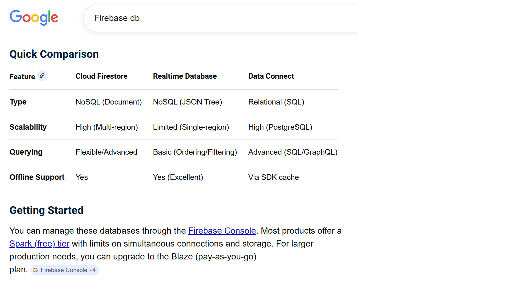

# Summary Data Flow, from Edge Device to Wifi to Firebase db (No USB).

Date: April 3, 2026 Friday  
Author: Jennifer Yoon  
Reviewed with Jason Yoon   

### Device Onboarding (Wi-Fi Provisioning without Bluetooth)

For initial demo units lacking Bluetooth, getting the device onto the user's home internet securely requires the SoftAP / Captive Portal method. This is the industry standard for headless IoT setup.  

* Step 1 (SoftAP Mode): On boot, the MAX78000 acts as its own Wi-Fi router, broadcasting an SSID like ECG_Demo_Setup.
* Step 2 (User Connects): The user connects their smartphone or computer to this setup network.
* Step 3 (Captive Portal): The device intercepts the connection and automatically opens a local webpage on the user's screen (similar to hotel Wi-Fi logins).
* Step 4 (Handshake): The user selects their home Wi-Fi network from a list and enters their password. The device saves these credentials, turns off its setup network, and connects to the internet to begin streaming.
* Cons: cannot be connected continuously via wifi, webpage auto time-out, battery runs out on device.
* Memo: 2 factor authentication is required with user data, to meet HIPPA compliance.  

### Resources/Constraints, MAX78000 microcontroller:

* 512K Flash Memory (50-60% reserved for Edge-AI prediction model)  
* But has Micro SD card connector, for more memory storage.
* 100 millisecond (0.10 second) is one packet of device output length
* 250 hertz (250 samples per second) is currently specified sampling speed (can go up to 1000 hertz?)  

### Proposed data flow:

* Device outputs 100 millisecond ecg sensor packets in binary, and buffers 3.0 second chunks into local memory (30 packets).  
* All outputs are timestamped. Streamed data can be out of order. Some fault tolerance and buffering expected.    
* Device streams via Wifi connection (initially no Bluetooth) directly to Firebase Store db (or to Google Cloud Storage bucket, a ***gcs bucket*** per Rebecca).
* Authentication already handled via SoftAP when device was turned on (wifi connection)
* Use Firebase Store (not real-time) to receive 3.0 second chunks in binary.
* Firebase convert binary to float-16 (later may change to float-8), and scale to millivolts.
* On Google Cloud Platform, have event listener and event handler to call Vertex AI session (Javascript? or interactive Python?)
* Assemble necessary time-chunks (10 or 12sec chunks in numpy or matlab file format) and run AI model(s). This can be at Firebase or at Vertex AI end. AI will save results to a specified folder on Google Cloud Platform.  
* Analysis Results and charts will be sent to user's web page (or saved on device's micro SD memory).
* Note1: Only Firebase Store is HIPPA compliant. Real-time Firebase stream is not. (gcs bucket is also HIPPA compliant)
* Note2: 100 millisecond stream is too fast for Real-time Firebase or Firebase Store to handle. Some chuncking is needed. 1.5 second is our standard window size for one heart-beat in our AI models. 3.0 seconds gives us 2 full windows to feed to our AI models. The 3.0 second chunk may contain 2-5 heart-beats at rest (40-100 bpm). A good compromise without being too large for device to handle.  

### Proposed Alternative: GCS Bucket as Raw Data Landing Zone  
Update by Rebecca, April 10, 2026   

Instead of streaming raw binary chunks directly to Firestore, a cleaner approach would be to use a Google Cloud Storage (GCS) bucket as the initial landing zone for data coming off the MAX78000 device. In this model, the device uploads each 3-second binary chunk to a GCS bucket via a signed URL, which automatically triggers a Cloud Function. That function handles the binary-to-float-16 conversion and millivolt scaling, then writes only the clean, structured data into Firestore, keeping raw binary storage completely separate from the application database. This separation has several advantages: GCS is better suited for raw binary files than Firestore, it provides a natural audit trail of unprocessed data, it makes the conversion step explicit and testable, and GCS is HIPAA eligible under Google's BAA, meaning it fits within the same compliance framework already in use. The rest of the pipeline, Firestore trigger, Cloud Function event handler, Vertex AI inference, and web app delivery, remains unchanged.

### Services Mentioned:

* Google FireStore db (No SQL, documents) and Firebase Real-Time db (No SQL, JSON tree)  
* Google Vertex AI - used for ecg diagnostic classification.    
* Google Cloud Identity Platform (HIPPA compliant). Note Firebase Auth is not HIPPA compliant
* Also Areteus needs to sign a Business Agreement with Google Cloud Platform to meet HIPPA compliance.  
* AMD MAX78000, device chip
* Google Cloud Storage bucket (gcs bucket)  

### Comparison, Google Firebase and other databases:   
  
