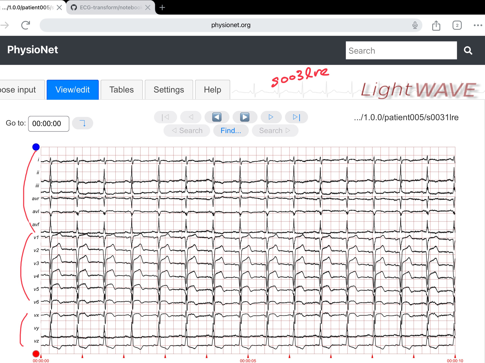
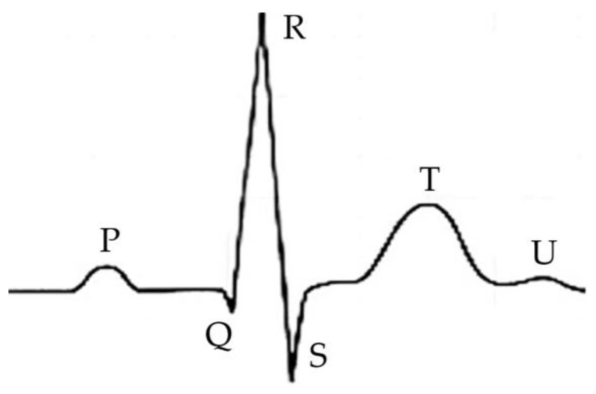

# data  

### 0. ECGTransform pre-processed data, .pt format
PyTorch library
torch.save(x.pt), torch.load(x.pt)  
MIT - train.pt, test.pt, val.pt  79mb  
PTB - train.pt, test.pt, val.pt   10mb  

***PTB *.pt data load success! Jan 3, 2025***   
train.pt, test.pt - structure is a dict, torch object.  
Author provided files, ex. train.pt, is a data file that has been serialized into binary format (byte read, byte write) using PyTorch format. Although PyTorch *.pt can be used to save model and training weights, these don't seem to be provided.  Model parameters and hyperparameters are provided in the code.  May need to run the model and train to reproduce the weights.  But author depended on a foundation model, so that needs to be researched. X no. Author did not use foundation model. Data is too simple, don't need to.  Try running code in loacl environments, no need to transfer to NB first.  
Also run simple CNN classification nb, Random Forest NB - w .pt data files.  

Keys are 'samples' and 'labels'.   
samples.values is a 3d array, col length 186, row length is sample numbers, varies by file, decimal numbers.  
labeles.values is 1d array, values are 1.0 or 0.0, float 64.  
```
  test.pt>   Shape of samples: torch.Size([2909, 1, 186])
  train.pt>  Shape of samples: torch.Size([9308, 1, 186])
```
> Next: find model weights, which foundation model was used? None.  
> AI from paper and source code   

MIT data 5 classes, PTB data only 2 classes (N normal, M mal)  
Most training was done on MIT data, then generalized to PTB data,   
but PTB data is of much higher quality, 15 channels vs 2 channels, 
and measuring device is medical grade vs ambulatory (noisy).  

### 1. Kaggle, pre-processed, .csv format, MITBIH and PTB data   

https://www.kaggle.com/datasets/shayanfazeli/heartbeat/data  
https://www.kaggle.com/datasets/shayanfazeli/heartbeat  

Jennifer Yoon Google Drive share link:   
 * https://drive.google.com/drive/folders/10g2ykTyd34b3VZ_TBanyEUpubhPhqhKb?usp=sharing  

Info:  
 * csv format, from Kaggle, preprocessed, MIT and PTB sources, 125 Hertz downsampled, both sources.  Each row is a sample and is fixed width of 188 columns.  Last column is a classification label (1 is abnormal, 0 is normal).  Each sample is approximately 1.5 seconds long, usually starts at the beginning of a major pumping action.  Samples that are longer than 1.5 seconds are cropped, shorter samples are zero padded, to fix row length to 188.     

 * MIT 109,446 samples, 
   five label categories ['N': 0, 'S':1, 'V':2, 'F':3, 'Q':4]   
   (2 channels is source data, both apprear in Kaggle data?)  
 * PTB 14,552 samples, two classes, in separate files.  
   (Q. how many lead channels were kept???)

 * These samples are too much chopped into a 1.5 second time frame (1-1.5 full heart beats, would be better to get a few continuous seconds on the PTB abnormal dataset.  Look at source data, unprocessed further by Kaggle.  Chopped ok for training base model, but PTB will be difficult to classify into different arrythemias without lead id.  Which of 12 leads are being shown?  

### 2. MIT BIH  
https://www.physionet.org/content/mitdb/1.0.0/

48 30-minute recordings from 2-channel ECG ambulatory 24-hour monitor (noisy), from 47 unique people.  
Recorded at BIH Lab (Beth Isreal Hospital), Boston 1975-79 period. Old tech, very old.  
Digitized to 360 samples per second, 11 bit resolution, 
2 physicians annotated each sample, clear up unreadable sections for computer to read.  

Fist channel is mostly MLII, modified limb lead 2.   
"The signal obtained from the modified lead II (MLII) ECG lead, which uses electrodes placed on the right arm and left leg, is the most commonly used signal in clinical practice for medical diagnosis. This lead provides a clear and consistent view of the electrical activity of the heart, particularly its rhythm, which is important for identifying both normal and abnormal heart functions in patients." Applsci 14 09307 g001, https://www.mdpi.com/2076-3417/14/20/9307  


### 3. PTB
https://physionet.org/content/ptbdb/1.0.0/  

594 high resolution 15 lead ECG from 294 subjects, digitized to 1000 samples per second, recording dates 1990 - 1997, in Germany. Much better, newer tech, high precision measuring device.  
Used in 1995 paper, Germany.   

Original data downloaded, binary format except header file in text format.  
Try numpy to read binary numerical data, row at a time.  
OpenAI instructions saved.  
PyTorch can also process binary numerical files.  
Filename identifies lead.  

#### PTB Waveform visualizer, PTB data from source   
Leads: (i, ii, iii, avr, avl, avf), (v1, v2, v3, v4, v5, v6), (vx, vy, vz)    
 * file format is binary, read using Numpy or PyTorch.
 * Sample Image, Waveform Visualizer, PTB website  
     

### 4. Physionet/CinC Challenge 2017  
https://www.kaggle.com/datasets/luigisaetta/physionet2017ecg/data  

MatLab all formats, data, code.  .m format  
Single channel data. Contributed from a device manufacturer, name to add later.  
 * sample notebook, simply nn: https://www.kaggle.com/code/luigisaetta/ecgnotebookphy1-binary
 * binary classification, normal vs abnoral, not binary file format. Read csv used.  

### 5. Other Kaggle, etc data sources  

Various notebooks at Kaggle provide links to pre-processed MIT and PTB source datasets, with different processing methods, sampled at different hertz, and mostly saved to .csv formats.  Some are binary file formats.  

### Heart Beat, idealized pattern  
**Figure 1** shows the signal of a normal heartbeat, which consists of the P wave, QRS complex and T and U waves, indicators that reflect the heart’s electrical activities, including repolarization and depolarization of the atrium and ventricle.
  
Applsci 14 09307 g001
https://www.mdpi.com/2076-3417/14/20/9307  

### 6. Chinese large labeled 12-lead dataset  

 * PDF link to add
 * data info to add  


### 7. Rodrigo's 12-lead datasets, survey research paper PDF  

 * Survey paper PDF:  papers/SPH_ECGdata_Nature_s41597-022-01403-5.pdf
 * 


