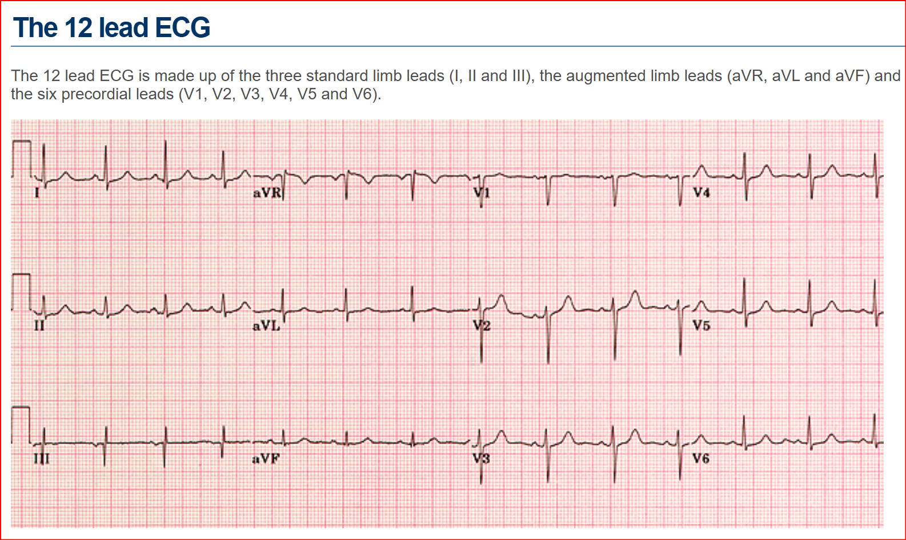

## Normal ECG 

#### Normal ECG values (table)
| Item            | value                     |
| --------------- | ------------------------- |
| Heart rate	 	 	| 60 - 100 bpm              |
| PR interval	 	 	| 0.12 - 0.20 s             |
| QRS interval	 	| 	≤ 0.12 s                |
| QT interval	 	 	| < half RR interval (males < 0.40 s; females < 0.44 s)  |
| P wave amplitude (in lead II)	 	                	| ≤ 3 mV (mm)          |
| P wave terminal negative deflection (in lead V1)	| ≤ 1 mV (mm)          |
| Q wave	 	      |< 0.04 s (1 mm) and < 1/3 of R wave amplitude in the same lead  |

#### Normal ECG signals, 1mm is 1mV  
Source: https://elentra.healthsci.queensu.ca/assets/modules/ECG/the_12_lead_ecg.html  

##### Normal ECG, Pattern Description  
Source: https://elentra.healthsci.queensu.ca/assets/modules/ECG/normal_ecg.html  
(Webpage copy)
Good source for feature engineering.  
Other pages has specifications for each diagnostic pattern and heart diagram of electrical flow direction.  

A normal ECG is illustrated above. Note that the heart is beating in a regular sinus rhythm between 60 - 100 beats per minute (specifically 82 bpm). All the important intervals on this recording are within normal ranges.

1.  P wave:

upright in leads I, aVF and V3 - V6
normal duration of less than or equal to 0.11 seconds
polarity is positive in leads I, II, aVF and V4 - V6; diphasic in leads V1 and V3; negative in aVR
shape is generally smooth, not notched or peaked

2. PR interval:

 Normally between 0.12 and 0.20 seconds.

3. QRS complex:

Duration less than or equal to 0.12 seconds, amplitude greater than 0.5 mV in at least one standard lead, and greater than 1.0 mV in at least one precordial lead. Upper limit of normal amplitude is 2.5 - 3.0 mV.
small septal Q waves in I, aVL, V5 and V6 (duration less than or equal to 0.04 seconds; amplitude less than 1/3 of the amplitude of the R wave in the same lead).
represented by a positive deflection with a large, upright R in leads I, II, V4 - V6 and a negative deflection with a large, deep S in aVR, V1 and V2
in general, proceeding from V1 to V6, the R waves get taller while the S waves get smaller. At V3 or V4, these waves are usually equal. This is called the transitional zone.

4. ST segment:

isoelectric, slanting upwards to the T wave in the normal ECG
can be slightly elevated (up to 2.0 mm in some precordial leads)
never normally depressed greater than 0.5 mm in any lead

5. T wave:

T wave deflection should be in the same direction as the QRS complex in at least 5 of the 6 limb leads
normally rounded and asymmetrical, with a more gradual ascent than descent
should be upright in leads V2 - V6, inverted in aVR
amplitude of at least 0.2 mV in leads V3 and V4 and at least 0.1 mV in leads V5 and V6
isolated T wave inversion in an asymptomatic adult is generally a normal variant

6. QT interval:

 Durations normally less than or equal to 0.40 seconds for males and 0.44 seconds for females.

 
