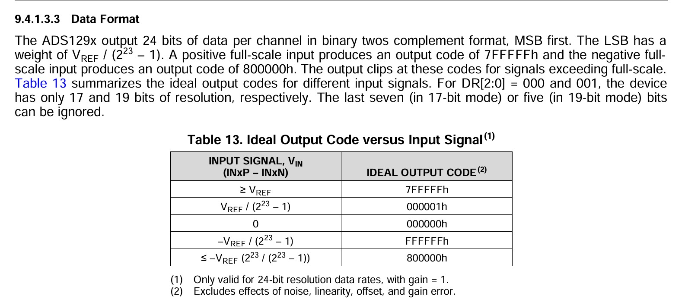

Q) Using the Output vs Signal file uploaded, please provide a Python code to convert ECG signals from previous step (hex to float python code) to ECG voltage signals
 


A) Of course. Using the technical specifications you provided, we can now convert the raw integer ADC (Analog-to-Digital Converter) values into their corresponding voltage signals.

The provided document specifies the formula for converting the output code to an input signal voltage.

### Conversion Formula

[cite_start]According to the "Data Format" section of the document, the relationship between the input voltage ($V_{IN}$) and the 24-bit signed integer output code is defined by the weight of the Least Significant Bit (LSB)[cite: 1]:

$V_{IN} = \text{Output\_Code} \times \frac{V_{REF}}{2^{23} - 1}$

Where:
* **Output\_Code** is the signed integer value we obtained from the previous hex-to-float conversion step.
* **$V_{REF}$** is the reference voltage used by the ECG device's ADC. **This value is critical for accurate conversion** and must be known from the device's hardware specifications. Common values for such devices are often in the range of 2.4V to 4.5V. The function below will require you to specify this value.
* The term **$2^{23} - 1$** represents the full positive scale for the 24-bit ADC ($8,388,607$).

### Python Code for Voltage Conversion

Below is a Python function that takes the NumPy array of raw ADC values and converts it into a NumPy array of voltage signals. The code is integrated with the previously developed function for parsing the hex file.

```python
import numpy as np
import re

def hex_to_raw_ecg(file_content):
    """
    Converts a hexadecimal ECG data file into a NumPy array of raw integer values.
    This function accounts for a 20-byte header and little-endian byte order.

    Args:
        file_content (str): The string content of the ECG data file.

    Returns:
        numpy.ndarray: A 2D NumPy array where each row is a time sample and
                       each column is an ECG channel's raw ADC value. Returns None
                       if the file is empty or no valid data blocks are found.
    """
    # Split the file content into blocks based on the "." separator
    blocks = re.split(r'\s*\.\s*', file_content)

    all_blocks_data = []

    for block_str in blocks:
        if not block_str.strip():
            continue

        hex_values = block_str.strip().split()

        # Beginning of each block has a 20-byte header to be stripped out.
        if len(hex_values) < 20:
            print(f"Warning: Skipping block, too small for 20-byte header.")
            continue
        
        data_hex_values = hex_values[20:]

        # Data portion should be 125 samples * 8 channels * 3 bytes/channel = 3000 bytes.
        if len(data_hex_values) != 3000:
            print(f"Warning: Skipping block with unexpected data size ({len(data_hex_values)} bytes).")
            continue

        block_samples = []
        for i in range(0, len(data_hex_values), 3):
            byte_chunk = data_hex_values[i:i+3]
            
            # Assemble the 24-bit hex number in LITTLE ENDIAN order (reverse bytes)
            hex_little_endian = "".join(byte_chunk[::-1])
            
            value = int(hex_little_endian, 16)
            # [cite_start]Perform sign extension for a 24-bit two's complement number [cite: 1]
            if value & 0x800000:
                value -= 0x1000000
            
            block_samples.append(value)

        if len(block_samples) == 1000:
            block_array = np.array(block_samples, dtype=np.int32).reshape(125, 8)
            all_blocks_data.append(block_array)

    if not all_blocks_data:
        return None

    return np.vstack(all_blocks_data)

def convert_to_voltage(raw_adc_array, v_ref):
    """
    Converts an array of raw ADC values to voltage signals.

    Args:
        raw_adc_array (numpy.ndarray): The NumPy array of signed integer ADC values.
        v_ref (float): The reference voltage of the ADC in volts.

    Returns:
        numpy.ndarray: A NumPy array of the same shape with values in volts.
    """
    # [cite_start]The LSB has a weight of V_REF / (2^23 - 1) [cite: 1]
    scaling_factor = v_ref / (2**23 - 1)
    
    # Apply the scaling factor to every element in the array
    voltage_array = raw_adc_array.astype(np.float64) * scaling_factor
    
    return voltage_array

# --- END-TO-END EXAMPLE USAGE ---

# 1. Assume 'full_file_content' contains the entire string from your .txt file
# For example:
# with open('ECG-single-02-19-2025-hex.txt', 'r') as f:
#     full_file_content = f.read()

# For this demonstration, we will use a small sample string.
# NOTE: This string is for demonstration. Use your full file content for actual conversion.
sample_hex_block = (
    "F4 12 FA FA 44 A4 00 00 00 00 00 00 B8 64 B6 67 DC DD C9 3F " # 20-byte Header
    "B8 64 B6 67 DC DD C9 3F C0 00 00 FD 7D E9 F1 54 1B 54 A0 C6 " # Data bytes...
    # ... This would be followed by 2976 more data bytes for a full block
)
# To make this example runnable, we will create a mock full block
mock_data_bytes = " ".join(["00"] * 3000)
full_file_content_mock = f"{sample_hex_block.split(' ', 20)[0]} {mock_data_bytes} ."


# 2. Convert the hex file content to a raw integer ADC array
raw_ecg_data = hex_to_raw_ecg(full_file_content_mock)

if raw_ecg_data is not None:
    # 3. Set the reference voltage (V_REF). 
    #    This value MUST match your device's specification for accurate results.
    #    Using 4.5V as an example.
    V_REFERENCE = 4.5  # Volts

    # 4. Convert the raw ADC values to voltage signals
    voltage_ecg_data = convert_to_voltage(raw_ecg_data, V_REFERENCE)

    print(f"Successfully converted data to voltage signals using V_REF = {V_REFERENCE}V.")
    print("Shape of the final voltage array:", voltage_ecg_data.shape)
    
    # Displaying the first 5 samples in Volts
    print("\nFirst 5 samples (in Volts):")
    print(voltage_ecg_data[:5, :])
    
    # To display in millivolts (mV), simply multiply by 1000
    print("\nFirst 5 samples (in millivolts):")
    print(voltage_ecg_data[:5, :] * 1000)

else:
    print("Could not parse raw ECG data from the file.")

```